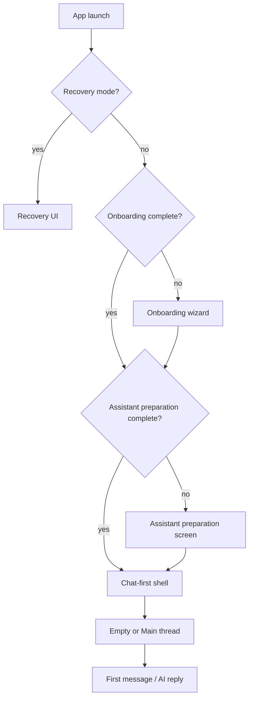

# First-Time User Flow (Phase 17H)

ContinuityOS can be exercised like a **brand-new installation** for onboarding QA without stale workspaces, conversations, or remembered setup state polluting the path.

## Design goals

1. **Chat stays primary** — conversation, messages, and composer dominate the main view.
2. **Project context lives in Tools** — objective, last progress, and suggested next step appear under **Tools → Backups**, not on the chat surface.
3. **Developer reset** — one action clears test pollution while **preserving snapshot backups**.
4. **Visible simulation path** — Diagnostics shows which step a fresh user would see next.

## User journey (fresh install)

### 1. Onboarding

- Trigger: `onboardingCompleted === false` in workspace-scoped `localStorage`.
- UI: `OnboardingWizard` — name assistant, choose how to start.
- No provider API keys on the welcome surface.

### 2. Assistant preparation

- Trigger: `assistantPreparationCompleted === false` (and not manual-only bypass).
- UI: `AssistantPreparationScreen` with **real** stage labels, download %, bytes, and ETA from `ai-download-progress-service` / `provisioning-readiness`.
- Generic **“AI is starting…”** copy is removed from composer and status badges; users see **“AI is preparing”**, **“Downloading AI…”**, or stage-specific messages.

### 3. First chat

- Empty thread list → **Main** thread created on first send or after reset.
- Chat welcome: assistant name + “What would you like to work on today?”
- No **Welcome back** panel on the chat column.

### 4. Daily chat

- Thread sidebar + messages + composer.
- Optional smart memory suggestion (dismissible); project resume content only in Tools.

## Tools → Backups layout

| Section | Content |
|--------|---------|
| **Continue project** | Objective, last progress, suggested next step (when memory exists) |
| **Project memory** | Full memory dashboard, health pill, memory update actions |
| **Backups** | Export, import, restore points (unchanged) |

## Reset experience (developer testing only)

**Location:** Diagnostics → Developer testing → **Reset experience**  
**Availability:** `import.meta.env.DEV` renderer panel; main-process IPC blocked when `NODE_ENV === "production"`.

### Cleared

- All threads and messages for the active workspace
- Timeline events, continuity records, memory fragments/states
- AI Life and continuity intelligence rows for the workspace
- Workspace continuity summary and description
- Provider configs and secure API keys for the workspace
- Assistant profile (reset to default name)
- Renderer `localStorage` onboarding / wizard / test keys (fresh onboarding written)

### Preserved

- **Snapshots** (manual and automatic backups in the snapshots table)
- Workspace record itself (same workspace id; new **Main** thread created)

### After reset

1. Onboarding wizard shows again.
2. Assistant preparation runs again (embedded local AI prepare).
3. Chat has no imported summary or prior messages.
4. **Continue project** section hidden until new memory exists.

## First-time user simulation (Diagnostics)

Read-only path indicator:

- Onboarding → Assistant preparation → First chat → Daily chat

Updates live from current `onboardingState`, preparation status, and thread count.

## AI status cleanup

| Before | After |
|--------|--------|
| `AI is starting…` | `AI is preparing` / `Downloading AI…` / stage message from `defaultAiConsumerMessage` |
| Generic composer hint | `resolveComposerHint({ consumerStatusMessage })` |
| Generic provider badge | `resolveProviderStatusPresentation` with provisioning state |

## Key files

| Area | Path |
|------|------|
| Shared reset + simulation | `src/shared/first-time-user-experience.ts` |
| DB reset | `electron/main/services/first-time-experience-reset-service.ts` |
| IPC | `experience:reset` in `src/shared/ipc-channels.ts` |
| Tools continue summary | `src/renderer/src/components/ProjectContinueSummary.tsx` |
| Dev panel | `src/renderer/src/components/FirstTimeExperienceDevPanel.tsx` |
| Tests | `tests/first-time-user-experience.test.ts`, `tests/first-time-experience-reset.test.ts` |

## Manual QA checklist

- [ ] Reset experience → onboarding appears
- [ ] Preparation shows download/prepare stages (not 0% stuck generic text)
- [ ] Chat has no Welcome back / objective blocks
- [ ] Tools → Backups shows Continue project when memory exists
- [ ] Snapshots still listed after reset
- [ ] Simulation path in Diagnostics matches visible UI
